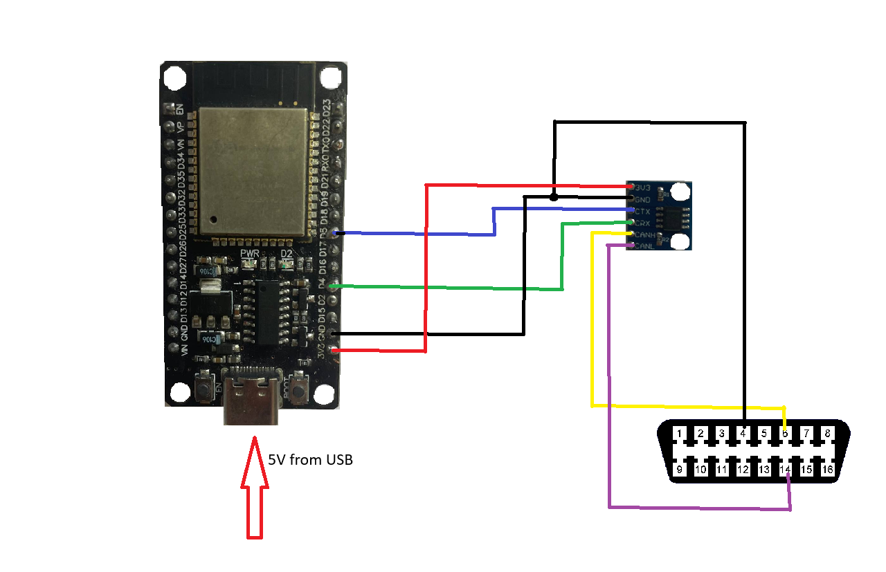
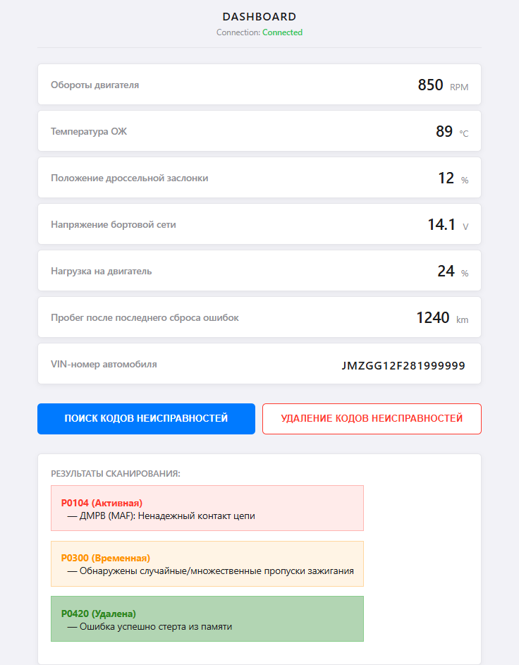

# ESP32 OBD2 CAN Scanner

A standalone automotive diagnostic scanner built on the **ESP32** microcontroller and a CAN transceiver for **HS-CAN (500 kbps)** networks, streaming real-time telemetry to a responsive web dashboard over Wi-Fi (WebSockets).

## Features & Capabilities
* **Real-Time Telemetry (Live Data):** Continuous monitoring of Engine RPM, Coolant Temperature, Throttle Position, Engine Load, Battery Voltage, and Distance traveled since DTC clear.
* **DTC Diagnostics:** Automated chained scanning of both confirmed active (Mode 03) and pending (Mode 07) diagnostic trouble codes with built-in offline database translation.
* **DTC Clear (Mode 04):** On-demand clearing of ECU fault memory and resetting the Check Engine light.
* **VIN Reader (Mode 09):** Automatic retrieval of the 17-character Vehicle Identification Number upon connection.
* **Custom ISO-TP Stack (ISO 15765-2):** Complete ground-up implementation of multi-frame packet reassembly (First Frame, Consecutive Frame, Flow Control) for handling long ECU responses.

## Tech Stack
* **Hardware:** ESP32 Dev Module, CAN Transceiver (SN65HVD230 3.3V), OBD-II (J1962) connector.
* **Firmware:** C++, ESP-IDF TWAI (CAN Driver), WebSockets, LittleFS.
* **Frontend:** HTML, CSS, JavaScript.

## Wiring Diagram

## Dashboard Example
